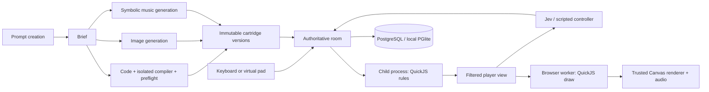

# Architecture as implemented

The authoritative Node service owns membership, player seats, controller assignment, match phases, inputs, results, generation jobs, and durable storage. React surrounds Canvas 2D; each browser loads a cartridge module into QuickJS inside a Web Worker. Game rendering emits a validated command buffer executed by the trusted canvas renderer.

## Deliberate deviations from the suggested stack

The room transport uses `ws` with explicit version/match/round/ownership/sequence checks instead of Colyseus. This avoids imposing a static schema on arbitrary generated views. The runtime remains independent of transport.

Local storage is genuine PostgreSQL via embedded PGlite, with the same parameterized SQL and migration supported by `pg` when `DATABASE_URL` is present. It provides a self-contained setup without a Docker daemon. Filesystem assets are addressed by SHA-256.

## Execution and determinism

TypeScript 5.9.3 is pinned for its JavaScript compiler API. Runtime generation uses a separate compiler process with no inherited provider secrets, a 192 MiB Node heap cap and a 25-second watchdog. Only the virtual SDK import is permitted. esbuild emits an IIFE which is evaluated only inside QuickJS, never as host/page JavaScript.

Rules execute in another process with a 96 MiB Node heap cap, sanitized environment, and bounded IPC queue/watchdog. QuickJS has no provided host functions, network or filesystem capabilities. Memory/stack/interrupt limits apply. This is a local application boundary; OS-level container hardening for public multi-tenant deployment is not yet certified.

Engine snapshots include RNG, state, scores, roles, buttons, time, outcomes, and wrapper state. Replays apply recorded actions and explicit timeout events rather than re-calling Jev. The reference headless test runs 100 episodes/game plus representative full replays and mid-episode restores.

## Rooms and controllers

Cartridge authors can use deterministic helpers for grid/list selection, held-direction repeat, hold/release timing, angular aiming, projectiles, scheduled spawns and button sequences. These consume accepted five-button input and simulation time; they do not query device state or wall time. Their mutable state belongs in `init`, separately for each player and interaction phase, and therefore travels through ordinary snapshots/replays. Existing `focus` keeps its flat wrapping behavior; `focusGrid` supplies clamped rows/columns. Held-repeat catch-up is capped and skips old repeat debt; spawn catch-up is capped but preserves overdue events for later steps. These distinct policies are documented in the SDK guide.

Semantic feedback drives a bounded presentation layer as well as audio. The browser retains at most 24 spatial bursts for 480 ms, deduplicates event IDs within a match/round/ownership scope, and draws small particles plus explicitly supplied reaction text after the cartridge frame. These trusted effects have separate canvas state and do not consume the cartridge's drawing-command budget or touch its simulation/RNG. A changed authoritative score remounts a brief CSS pulse. Live events carry the match ID so a late event cannot animate another match.

Independent/race views render only their player's spatial effects, rotating wrapper views match the active player, and obscured views show none. These are presentation filters, not changes to the wire protocol's visibility policy. Backgrounding, disconnects and transitions clear bursts. Replays use traversed recorded events and clear effects on pause/seek; rewinding starts a fresh deduplication scope. The current reduced-motion preference suppresses optional canvas effects and the CSS score pulse. Essential game objects and timing cues continue to render.

States are lobby → preparing → countdown → playing → round-result → match-result. Browsers preload pinned media and acknowledge readiness. Real-time simulation targets 60 Hz; snapshots target 20 Hz. Action-driven games step only for input and explicit timeout events. A process failure aborts the match without fabricated score credit.

A local Apple M2/24 GiB profile completed 1, 4 and 8 concurrent four-seat Asteroid rooms through production runtime children and PGlite. At eight profiled rooms, simulation/wall ratio stayed at least 0.9984, the largest per-client snapshot p95 was 62.37 ms, and the largest individual gap was 199.23 ms. All 13 matches replayed exactly. This short protocol profile excludes Jev, generation, remote networking and browser-frame measurements; one additional browser Toast room overlapped the eight-room wave. It does not establish a maximum room limit. See `evidence/runtime/room-capacity.json` and PLAYTEST.md.

Stable seats are separate from browser/Jev/scripted ownership. Connected human seats suppress automated decisions. Disconnect/reconnect increments an epoch, releases held inputs and invalidates outstanding decisions. Roles also invalidate epochs. Jev has one outstanding request per seat, aligned 200 ms opportunity boundaries, a 1.2-second request timeout, and stale-round/epoch/role rejection. Failed decisions use the recorded scripted fallback. A shared provider pool limits global outstanding calls, with explicit fallback labels and retained decision metrics.

The server probes each connected client using a single-use nonce. Echo timestamps use the browser's monotonic performance clock; measured server round trips estimate the offset. The lowest-RTT sample from a rolling 20-second window resists queueing spikes. Starts and countdowns share wall-compatible monotonic server time. Half RTT is an uncertainty bound, not evidence of symmetric paths.

A synchronized input timestamp is a bounded claim. The age budget is the smaller of 150 ms and half the minimum RTT plus measured jitter (up to 50 ms) plus 25 ms. Future claims beyond 25 ms, backwards timestamps and stale presses are rejected. Releases remain accepted to clear held controls. Unsynchronized/legacy clients receive no timestamp compensation. Match, round, role epoch and sequence validation apply first; sequence counters restart on every epoch on both ends. Compensation cannot carry a press into the next role.

Accepted input ages are computed against the 60 Hz simulation boundary and recorded in the replay journal. `timedPress` corrects a declared continuous timing sweep by at most 150 ms; it does not rewind arbitrary game state or trust client outcomes. Other games continue to receive authoritative controller edges. `gfx.project` projects explicitly supplied public motion by at most 250 ms for display. Skill Continue uses both helpers. Rendering follows animation frames with one outstanding sandbox request. Generic movement prediction/reconciliation and broader visual interpolation remain work to complete.

Timing precision remains bounded by simulation ticks, input/display scheduling, clock asymmetry, and stalls. A connection beyond the correction budget can still miss; it does not receive an arbitrarily widened success window. Full-match latency tests use ordered application-layer delay in both WebSocket directions; see the playtest report for measured results and limits.

## Versions, scoring and restart

Source, module, metadata, gameplay assets, optional cartridge icon, music, SDK/runtime identifiers determine immutable version hashes. Legacy icon-less hashes remain unchanged. Challenges pin a sequence and seed policy. Late music/art/icon creates another version. Results use a unique match/round/player key for idempotent inserts. Party points award two per opponent beaten and one per opponent tied; incomparable raw scores are never summed. Solo success awards three points.

Creation reserves one slot per owner and at most two slots across the service before its initial database write. After that admission is durable, one five-minute work budget covers the brief, parallel code/art/music/icon branches, repair attempts and compilation. Requests use the shared cancellation signal; expiry also kills an active compiler. The compiler retains its independent 25-second watchdog. Checks after asynchronous work discard late results even when an adapter ignores cancellation. Icon failure is recorded on its branch while a playable game can still publish. Publication checks the budget within the game/version transaction, rolling back if it has expired before commit. A database commit already in progress is not cancellable; initial admission and terminal persistence are awaited separately from the work deadline.

New rule generation takes only the author prompt for game format. The brief chooses realtime or action clock from that prompt, and preflight requires generated metadata to declare `players:[1,4]` with rules for each party size. Old `format` request fields are accepted but ignored. Music-only and media-only updates keep the saved code, runtime, metadata and clock, including historical player bounds; the room engine handles their party adaptation.

Defaults allow eight provider requests, 300,000 cumulative UTF-8 request-body bytes, 54,000 reserved text-output tokens, two low-quality 1024×1024 images (a gameplay sprite and a separate cartridge cover), three code attempts and two music attempts. Each dispatch reserves its entire requested allowance and failures do not refund it. These limits bound provider work; they are not an exact dollar invoice limit or a refund guarantee for cancelled requests. Configuration lives in `.env.example`; invalid limits fail startup. Jobs persist their effective limits, reservations and returned provider usage. The in-memory cache retains at most 32 finished jobs plus active jobs, while owner-filtered durable history remains available.

Terminal job records reject late progress writes. An expired job remains failed, an existing draft remains available, and a retry gets a fresh job/version. Immutable files written before an interrupted publication can remain unreferenced; cancellation does not delete shared content-addressed assets.

Leaderboard partitions record version, difficulty, count, mode and actual controller sources. Within one partition, the UI filters recorded controls (keyboard, virtual pad, both, or no recorded method) and shows objective success, median, score distribution and each participant’s best score. A normal rule-defined loss counts as a completed round. Attempt completion and replay/rematch rates use explicitly tracked attempts; legacy score-only records do not enter those denominators. Creator repair/failure counts are scoped to the authenticated owner.

Socket authentication and commands use one ordered queue per connection, bounded to 64 pending messages and 100 received messages per second. A duplicate join cannot bind one socket to several seats. Room membership changes, control commands and simulation steps share a serialized queue; an asynchronous start, cartridge load or abort cannot race the next command. WebSocket ping/pong runs every 15 seconds and terminates a peer after a missed response at the following check. A disconnected seat immediately uses the configured bot, with a new ownership epoch; reconnecting resumes that seat. A departing host transfers authority to the next connected member and does not reclaim it automatically on returning.

Rooms are swept every 30 seconds. A room with no connected members expires after two minutes; a connected lobby/result room expires after thirty minutes without activity. Active rooms with connected members follow their game deadlines. Expiry disposes the cartridge worker and removes the room; interrupted rounds receive no fabricated result. Graceful shutdown awaits room persistence before closing the database.

## Sources consulted

- [QuickJS runtime limits](https://github.com/justjake/quickjs-emscripten)
- [PGlite local PostgreSQL](https://pglite.dev/docs/)
- [TypeSafe HTTP API](https://docs.typesafe.ai/api)
- [OpenAI structured output](https://developers.openai.com/api/docs/guides/structured-outputs)
- [OpenAI image generation](https://developers.openai.com/api/docs/guides/image-generation)

These sources informed integration APIs. Local test evidence, rather than vendor claims, establishes behavior here.

Publication readiness is included in the immutable version hash, so a final version cannot collide with a provisional version merely because media finished quickly. Generated WAVs are preloaded and decoded for playback; the score remains available for inspection and reproducibility. The global Jev pool admits at most `JEV_CONCURRENCY` calls with no waiting queue. Native observations omit wrapper-only active-player fields. For discrete confirmations/interference, a held action narrows the next Jev choice to released-action states before another press can occur; movement/confirmation still passes through the normal five-button engine input path.

Seeded random selection is performed on the backend using a stable sorted eligible pool and Fisher–Yates shuffle. The selection seed, constraints, pool, and resolved versions are stored in the challenge; this selection seed is separate from the simulation seed. UI parties get a random server seed. Simulation seeds stay out of live room/public challenge views and become available to party members with completed replay records. Explicit seed inputs remain available for reproducible local protocol tests. Fixed-seed rematches intentionally allow learning the same challenge.

Replays instantiate the pinned cartridge/runtime and replay accepted events without model calls. Party members can select a point of view, seek, and verify the final snapshot. Only recorded members of the actual match may fetch ended replay details; creating the source challenge does not grant access to later parties that play it. Leaderboards select one partition at a time and take each participant's best raw score in the cartridge's declared direction.

Replay playback follows recorded elapsed time, including waits before turn-based actions. Only forward traversal emits recorded feedback; seeking and changing point of view are silent. Each rewind starts a fresh feedback traversal. The shared mixer plays the pinned soundtrack from the replay position and releases it on pause, seek, round replacement or close. At 2×/4×, the loop's playback rate and pitch increase with the replay; use 1× to judge original music. Backgrounding pauses replay. Live-room feedback is suppressed while the replay owns the mixer.

Playback permits one outstanding advance request, identified by revision and request ID. A delayed response cannot release a newer request. Each request carries an absolute recorded-time target, so skipped display polls do not lose elapsed time or accumulate queued work. An unresponsive playback worker is terminated after 1.5 seconds of active polling and the UI explains how to reopen the recording.

Lobby setup uses the same shared compatibility predicate as random selection and runtime startup. Empty seats exist as bot placeholders immediately; joining humans replace them without expanding the target count. Each slot stores its Jev/practice fallback preference, including after a human takes over. Only the host can add/remove bot slots, change their controllers, or edit the ordered queue, and only in the lobby. A newly added cartridge may require adding bot seats; an incompatible queue is rejected atomically. Connected human seats cannot be removed. Lobby reindexing resets ownership epochs and the client receives its current player ID in each state.

The random-party UI exposes duration, clock, controls, tags and participant settings, using the same eligible count as the backend. Selection records retain their original party settings and sampled versions as provenance. If a host subsequently edits the lobby, the challenge's top-level versions/settings describe the final queue; the original selection remains an audit record, not a claim that later manual additions satisfy the old filters. Every changed setup invalidates the pending challenge ID; starting creates another immutable challenge. Untouched same-seed rematches retain their existing challenge. Queue writes carry a setup revision to reject stale edits, and edits reset connected members' readiness.

Creation can be an explicit lobby phase: the host keeps its socket and identity while using the normal generation UI, and others see that creation is in progress. Finished versions can be appended through the same validated queue operation. Returning to the lobby releases the creation hold; the host cannot start while that hold is active. Disconnecting the host clears it. A job continues independently when the host returns to the lobby and can be reopened from saved creation history. Returning from match results to setup preserves the saved match before clearing transient round state.

Generation admits two jobs globally and one per owner, reserving capacity before the initial database write. A failed initial write releases that reservation without calling providers. Terminal persistence failures are caught, reported as failed jobs in memory, and retried once; a lasting storage outage is reconciled by startup recovery. Reservations last until terminal handling settles, including its persistence attempt.

## Checkpoints and recovery

Match start persists the actual participants, immutable challenge definition, settings and start time before preparation. The room saves an initial runner snapshot and a checkpoint every five wall-clock seconds during play. Each includes the accepted journal, pinned version/runtime reference, seed/configuration, filtered controller records and full authoritative snapshot. Checkpoints are private server data and are never included in live room views.

A completed round commits all player results, its completed replay and the attempt status in one transaction. A failed insert rolls back the entire batch and preserves the prior checkpoint. Graceful shutdown captures a final usable checkpoint, marks the match interrupted and closes connections. On abrupt restart, startup marks previously playing matches and preparing/playing attempts interrupted; it also durably marks unfinished generation jobs failed so history and repair counts agree.

The saved recording is bounded by the last successful checkpoint. A measured SIGKILL test lost 3.567 seconds of unsaved play; five seconds is the target checkpoint cadence, not a guarantee under storage stalls or failure. No unfinished-round scores are inserted and active rooms are not transparently resumed. Completed rounds stay scored. On recovery, `finishedAt` is detection time, while the last persisted `durationMs` and round time describe the recorded extent; the exact crash instant is unknown.

Replay eligibility uses start-time membership or, for older records, participant identities in completed rounds. The source challenge owner cannot inspect an unrelated party. Legacy records with neither form of membership cannot be proven accessible and are omitted. Partial rounds appear in the replay selector, stop at the checkpoint even when game rules have not ended, and verify against that saved snapshot. Pressing Play records at most one replay viewer per match/guest; merely opening, seeking or switching perspective does not count.

Same-room rematches record the preceding match ID. Replay/rematch engagement counts distinct finished tracked parties, and active/interrupted/abandoned/technical attempts are reported separately. New tracking does not manufacture historical completion or engagement evidence. `DATA_DIR` configures database/assets isolation for local tests; no other process should open the application's live PGlite directory.

Closed WebSockets disable gameplay and party mutations. A server shutdown, expired room or missing room produces a terminal message and a return-to-arcade action. Transport loss offers reconnect; a replaced connection explicitly offers to move the seat back to this tab. A stale socket cannot overwrite a newer connection's state. Audio and held controls stop when the connection closes.

## Presentation boundary validation

Command validation checks exact operation arity and numeric/string types, finite nested path/frame values, stack balance and cumulative transforms before touching Canvas. Paths have at most 256 points, text at most 240 characters, the stack at most 32 levels, and a complete frame at most 1,200 commands / 180 KB UTF-8. The trusted renderer verifies source frame bounds against the decoded image. It wraps each frame in saved Canvas state and unwinds every nested save on failure, so top-level clips do not persist into later frames.

Image-model output passes an encoded-size/PNG-signature gate before native decoding, then dimension limits before statistics or resize: 20 MB, 4.5 million pixels, 4096 maximum side, one page, actual transparency. The stored sprite remains a normalized 256×256 PNG. Game-declared assets are bounded unique logical names, not URLs.

Targeted tests execute a looping game concurrently with a healthy game in separate processes; the failing game is interrupted and the healthy game advances. A 64 MiB allocation fails within the 16 MiB sandbox heap, and direct/reflected global access exposes no process, filesystem, network, browser or audio host capabilities. These probes add evidence for the application boundary; they do not certify public multi-tenant OS isolation.

## Cabinet presentation and menu input

`GameCabinet` wraps both live and replay canvases. Cartridges draw only gameplay; the wrapper owns border/HUD/controls. `Engine.observe` calls optional `hud` with a frozen clone of the already filtered view, validates bounded plain text and participant IDs, and includes it in the observation. Obstruction drops both game and HUD. There is no additional access to hidden state. This additive runtime change produces new immutable runtime hashes; old versions keep their recorded runtime.

A separate client navigation layer handles spatial WASD/arrow selection, confirmation, Escape, form-edit mode and dialog focus. Arrow candidates are scoped to the active dialog or main screen; header and marked menu/party shortcuts are excluded. Ordinary Tab activation remains available. Escape opens a shared Options overlay on every screen; closing it restores the previous selection, and nested settings close before Options. During play, it yields the five logical game buttons to `Controller`. Opening a cabinet menu releases held input; online simulation continues. Random launch and single-cartridge Play create a room, request one host start on the first lobby snapshot, preload and count down automatically. Launch state guards duplicate clicks and cancels late create responses after leaving. The dedicated invite-lobby path remains separate.

### Controller context and creation reveal

`server/controllers.ts` extracts rule callbacks and helpers from the pinned TypeScript source, removing top-level cartridge draw/HUD/media declarations and caching at most 32 sources. Each Jev request includes public `meta.rules` (falling back to description), the same player view and HUD used in the browser, history, the seat's held controls, tick/time, request cadence and estimated response delay. A bounded generic walk highlights visible entities whose id/playerId matches the seat. Choice labels distinguish pressing from continuing a hold and releasing. This remains one model decision per automated seat; generated cartridges contain no provider calls. Logs record the controller context version alongside actual provider model, latency, choice and confidence.

Generation progress now exposes ready content-addressed art/music assets before code completes. `CreationShowcase` owns the shared mixer while visible, reveals those assets, and renders an actual first-frame cartridge preview using a disposable QuickJS worker. New creation auto-play uses the ordinary room launch path and waits while options are open or the page is hidden. Saved jobs can be reopened without auto-launch. A focus target on the showcase prevents creation-history buttons from scrolling the user away from the reveal.

### Music provider extension

`GenerationService` accepts an optional trusted server `MusicGenerationAdapter` as its fourth constructor argument. The default symbolic adapter preserves model score generation and local synthesis. An adapter may instead return bounded PCM16 WAV bytes, validated loop boundaries, tempo/meter/bar count, gain, provider/model provenance and numeric usage. No browser-provided adapter, URL or executable content is accepted. Reserve every provider request through `MusicContext.reserve`, use its cancellation signal, and bound downloads before allocating a response. The shared generation deadline rejects late output. Validation enforces file/loop length, header consistency, musical length and signal quality before immutable asset publication. Rendered-file output does not need a synthetic score; playback, audit and persisted manifests support it. Integration tests cover exact bytes, stereo, retry, budget exhaustion, cancellation and reopen. No optional external audio-native provider has been deployed or claimed as live-tested.
