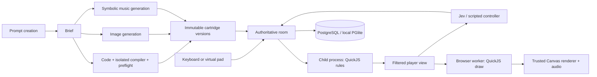

# Architecture as implemented

The authoritative Node service owns membership, player seats, controller assignment, match phases, inputs, results, generation jobs, and durable storage. React surrounds Canvas 2D; each browser loads a cartridge module into QuickJS inside a Web Worker. Game rendering emits a validated command buffer executed by the trusted canvas renderer.

## Deliberate deviations from the suggested stack

The room transport uses `ws` with explicit version/match/round/ownership/sequence checks instead of Colyseus. This avoids imposing a static schema on arbitrary generated views. The runtime remains independent of transport.

Local storage is genuine PostgreSQL via embedded PGlite, with the same parameterized SQL and migration supported by `pg` when `DATABASE_URL` is present. It provides a self-contained setup without a Docker daemon. Filesystem assets are addressed by SHA-256.

## Execution and determinism

TypeScript 5.9.3 is pinned for its JavaScript compiler API. Runtime generation uses a separate compiler process with no inherited provider secrets, a 192 MiB Node heap cap and a 60-second watchdog. Preflight executes each party size from one through four, including the necessary independent attempts, and checks each player's final drawing. Only the virtual SDK import is permitted. esbuild emits an IIFE which is evaluated only inside QuickJS, never as host/page JavaScript.

Rules execute in another process with a 96 MiB Node heap cap, sanitized environment, and bounded IPC queue/watchdog. QuickJS has no provided host functions, network or filesystem capabilities. Memory/stack/interrupt limits apply. This is a local application boundary; OS-level container hardening for public multi-tenant deployment is not yet certified.

Engine snapshots include RNG, state, scores, roles, buttons, time, outcomes, and wrapper state. The live party adapter uses these snapshots in memory to switch between private player worlds. The reference headless test runs 100 episodes/game plus representative mid-episode restores.

## Rooms and controllers

Cartridge authors can use deterministic helpers for grid/list selection, held-direction repeat, hold/release timing, angular aiming, projectiles, scheduled spawns and button sequences. These consume accepted five-button input and simulation time; they do not query device state or wall time. Their mutable state belongs in `init`, separately for each player and interaction phase, and therefore travels through live adapter snapshots. Existing `focus` keeps its flat wrapping behavior; `focusGrid` supplies clamped rows/columns. Held-repeat catch-up is capped and skips old repeat debt; spawn catch-up is capped but preserves overdue events for later steps. These distinct policies are documented in the SDK guide.

Semantic feedback drives a bounded presentation layer as well as audio. The browser retains at most 24 spatial bursts for 480 ms, deduplicates event IDs within a match/round/ownership scope, and draws small particles plus explicitly supplied reaction text after the cartridge frame. These trusted effects have separate canvas state and do not consume the cartridge's drawing-command budget or touch its simulation/RNG. A changed authoritative score remounts a brief CSS pulse. Live events carry the match ID so a late event cannot animate another match.

Independent/race views render only their player's spatial effects, rotating wrapper views match the active player, and obscured views show none. These are presentation filters, not changes to the wire protocol's visibility policy. Backgrounding, disconnects and transitions clear bursts. The current reduced-motion preference suppresses optional canvas effects and the CSS score pulse. Essential game objects and timing cues continue to render.

States are lobby → preparing → countdown → playing → round-result → match-result. Browsers preload pinned media and acknowledge readiness. Real-time simulation targets 60 Hz; snapshots target 20 Hz. Action-driven games step only for input and explicit timeout events. A process failure aborts the match without fabricated score credit.

A local Apple M2/24 GiB profile completed 1, 4 and 8 concurrent four-seat Asteroid rooms through production runtime children and PGlite. At eight profiled rooms, simulation/wall ratio stayed at least 0.9984, the largest per-client snapshot p95 was 62.37 ms, and the largest individual gap was 199.23 ms. The historical profile also verified its then-supported recordings. This short protocol profile excludes Jev, generation, remote networking and browser-frame measurements; one additional browser Toast room overlapped the eight-room wave. It does not establish a maximum room limit. See `evidence/runtime/room-capacity.json` and PLAYTEST.md.

Stable seats are separate from browser/Jev/scripted ownership. Connected human seats suppress automated decisions. Disconnect/reconnect increments an epoch, releases held inputs and invalidates outstanding decisions. Roles also invalidate epochs. Jev has one outstanding request per seat, aligned 200 ms opportunity boundaries, a 1.2-second request timeout, and stale-round/epoch/role rejection. Failed decisions use the recorded scripted fallback. A shared provider pool limits global outstanding calls, with explicit fallback labels and retained decision metrics.

The server probes each connected client using a single-use nonce. Echo timestamps use the browser's monotonic performance clock; measured server round trips estimate the offset. The lowest-RTT sample from a rolling 20-second window resists queueing spikes. Starts and countdowns share wall-compatible monotonic server time. Half RTT is an uncertainty bound, not evidence of symmetric paths.

The countdown lasts `COUNTDOWN_MS` (three one-second beats, shared in `shared/countdown.ts`). Its absolute `startsAt` deadline survives snapshots and reconnects. Before rendering each room state, the shell calls `ClientClock.observeState` and reads the clock in the same update; a first snapshot can initialize the clock even before a probe arrives. Keep that clock across same-page socket reconnects. Subsequent offset corrections slew at at most 50 ms per second, so the clock never jumps backward or skips a beat. Audio and visuals use the same `countdownValue`; the final `1` remains until the authoritative phase changes to `playing`. The lineup intro uses the same deadline. Only the server starts simulation and accepts input; a timestamp from before `startsAt` cannot be compensated into gameplay. Probe measurements and server latency budgets are unchanged.

A synchronized input timestamp is a bounded claim. The age budget is the smaller of 150 ms and half the minimum RTT plus measured jitter (up to 50 ms) plus 25 ms. Future claims beyond 25 ms, backwards timestamps and stale presses are rejected. Releases remain accepted to clear held controls. Unsynchronized/legacy clients receive no timestamp compensation. Match, round, role epoch and sequence validation apply first; sequence counters restart on every epoch on both ends. Compensation cannot carry a press into the next role.

Accepted input ages are computed against the 60 Hz simulation boundary. `timedPress` corrects a declared continuous timing sweep by at most 150 ms; it does not rewind arbitrary game state or trust client outcomes. Other games continue to receive authoritative controller edges. `gfx.project` projects explicitly supplied public motion by at most 250 ms for display. Skill Continue uses both helpers. Rendering follows animation frames with one outstanding sandbox request. Generic movement prediction/reconciliation and broader visual interpolation remain work to complete.

Timing precision remains bounded by simulation ticks, input/display scheduling, clock asymmetry, and stalls. A connection beyond the correction budget can still miss; it does not receive an arbitrarily widened success window. Full-match latency tests use ordered application-layer delay in both WebSocket directions; see the playtest report for measured results and limits.

## Versions, scoring and restart

Source, module, metadata, gameplay assets, optional cartridge icon, music, SDK/runtime identifiers determine immutable version hashes. Legacy icon-less hashes remain unchanged. Challenges pin a sequence and seed policy. All generated media is attached before publishing the version. Results use a unique match/round/player key for idempotent inserts. Party points award two per opponent beaten and one per opponent tied; incomparable raw scores are never summed. Solo success awards three points.

Creation and edits share the project/turn pipeline in `server/projects.ts`. PostgreSQL queues work for independent workers; local PGlite uses the same pipeline in process. Admission is durable, bounded and fair across owners. Worker leases and generations fence late writes, cancellation and recovery. Each project has one writer. API restarts do not mark other workers' work failed.

The studio stores private revisions, messages and replayable progress events. Codex app-server runs as an unprivileged process inside a disposable Blaxel microVM over private stdio. Bounded thread files, the selected source and input traces allow continuation after microVM deletion. Initial media is generated first; subsequent edits reuse it unless explicitly replaced. Unchanged source is not rerendered. Changed candidates can produce independent work-in-progress PNGs before full validation.

Only a fresh independent validator's compiled code/runtime become a playable revision. Publish atomically promotes the selected revision and its assets; the library follows `games.published_version`, so republishing an older selected version works without rebuilding. Public routes, private assets, references and room admission all enforce visibility. Browser playtesting uses the existing renderer and an isolated QuickJS worker and does not create public results. Detailed flow and limits: [interactive builder](INTERACTIVE_GAME_BUILDER.md), [sandbox controls](SANDBOXED_GAME_BUILDER.md).

Leaderboard partitions record version, difficulty, count, mode and actual controller sources. Within one partition, the UI filters recorded controls (keyboard, virtual pad, both, or no recorded method) and shows objective success, median, score distribution and each participant’s best score. A normal rule-defined loss counts as a completed round. Attempt completion and rematch rates use explicitly tracked attempts; legacy score-only records do not enter those denominators. Creator repair/failure counts are scoped to the authenticated owner.

Socket authentication and commands use one ordered queue per connection, bounded to 64 pending messages and 100 received messages per second. A duplicate join cannot bind one socket to several seats. Room membership changes, control commands and simulation steps share a serialized queue; an asynchronous start, cartridge load or abort cannot race the next command. WebSocket ping/pong runs every 15 seconds and terminates a peer after a missed response at the following check. A disconnected seat immediately uses the configured bot, with a new ownership epoch; reconnecting resumes that seat. A departing host transfers authority to the next connected member and does not reclaim it automatically on returning.

Rooms are swept every 30 seconds. A room with no connected members expires after two minutes; a connected lobby/result room expires after thirty minutes without activity. Active rooms with connected members follow their game deadlines. Expiry disposes the cartridge worker and removes the room; interrupted rounds receive no fabricated result. Graceful shutdown awaits room persistence before closing the database.

## Sources consulted

- [QuickJS runtime limits](https://github.com/justjake/quickjs-emscripten)
- [PGlite local PostgreSQL](https://pglite.dev/docs/)
- [TypeSafe HTTP API](https://docs.typesafe.ai/api)
- [OpenAI structured output](https://developers.openai.com/api/docs/guides/structured-outputs)
- [OpenAI image generation](https://developers.openai.com/api/docs/guides/image-generation)

These sources informed integration APIs. Local test evidence, rather than vendor claims, establishes behavior here.

Publication readiness is included in the immutable version hash, so a final version cannot collide with a provisional version merely because media finished quickly. Generated WAVs are preloaded and decoded for playback; the score remains available for inspection and reproducibility. The global Jev pool admits at most `JEV_CONCURRENCY` calls with no waiting queue. Native observations omit wrapper-only active-player fields. For discrete confirmations/interference, a held action narrows the next Jev choice to released-action states before another press can occur; movement/confirmation still passes through the normal five-button engine input path.

Seeded random selection is performed on the backend using a stable sorted eligible pool and Fisher–Yates shuffle. The selection seed, constraints, pool, and resolved versions are stored in the challenge; this selection seed is separate from the simulation seed. UI parties get a random server seed. Simulation seeds stay out of live room/public challenge views and match-summary responses. Explicit seed inputs remain available for reproducible local protocol tests. Fixed-seed rematches intentionally allow learning the same challenge.

Ordinary rounds use the versioned `party-v1` adapter at the Sandbox boundary. It uses the pinned runtime's native API, preserving shared worlds within their authored limits and providing equal-seed private attempts when a cartridge has fewer slots. Private attempts use local contiguous IDs and map score, role, input and HUD ownership back to party seats. The adapter saves/restores its worlds in memory during live play; no per-tick journal or persistent runner snapshot is written. Party members may fetch a compact completed-match summary, subject to actual match membership. Older records are projected to the same summary shape without exposing their stored journals or snapshots. Leaderboards select one partition at a time and take each participant's best raw score in the cartridge's declared direction.

Lobby creation accepts an empty queue, reserves the creator's seat, and defaults to one participant. Joining humans use unclaimed slots or expand the lobby up to four people; disconnected identities remain reserved for reconnect. At start the engine fills any required native minimum with AI seats, while adapters make every cartridge selectable at every party count. Each slot retains its Jev/practice fallback preference. Queue selection, random selection and start are host-only; joiners wait without a Ready gate. Legacy bot-slot commands remain accepted in the lobby, and connected human seats cannot be removed. Lobby reindexing resets ownership epochs and the client receives its current player ID in each state.

Random selection defaults to four finished cartridges and uses the same adaptation rules as a manually selected queue. Older duration, clock, control and tag request filters remain supported. Selection records pin the seed, pool and resolved versions; a later manual queue edit clears that random-selection record. Every changed setup invalidates the pending challenge ID; starting creates another immutable challenge. Untouched same-seed rematches retain their existing challenge. Queue/random writes carry a setup revision to reject stale edits. A host can also select and start in one revisioned socket command. The client flow and new authoring contract are specified in `PARTY_CONTRACT.md`.

Creation can be an explicit lobby phase: the host keeps its socket and identity while using the normal generation UI, and others see that creation is in progress. Finished versions can be appended through the same validated queue operation. Returning to the lobby releases the creation hold; the host cannot start while that hold is active. Disconnecting the host clears it. A job continues independently when the host returns to the lobby and can be reopened from saved creation history. Returning from match results to setup preserves the saved match before clearing transient round state.

Generation admission uses a transactional queue with a configurable global active-turn cap and one active turn per owner/project. A creator can queue follow-ups while a previous version stays playable. Idempotency keys reject conflicting duplicate submissions. Lease recovery affects expired work only, and a fenced completion transaction prevents stale workers from writing revisions or changing the selected game.

## Match persistence and recovery

Match start persists the actual participants, immutable challenge definition, settings and start time before preparation. The room keeps live views and adapter snapshots in memory and does not persist input journals, periodic checkpoints or unfinished-round state.

A completed round commits every player result, a compact round summary and the attempt status in one transaction. A failed insert rolls back the entire batch. Graceful shutdown marks the match interrupted and closes connections. On abrupt restart, startup marks previously playing matches and preparing/playing attempts interrupted; generation workers independently recover expired leases without invalidating healthy work. No unfinished-round scores are inserted and active rooms are not transparently resumed. Completed rounds stay scored.

Match summaries use start-time membership or, for older records, participant identities in completed rounds. The source challenge owner cannot inspect an unrelated party. Legacy records with neither form of membership cannot be proven accessible and are omitted. Summary responses include scores, outcomes, points and lifecycle metadata; they omit historical input journals, snapshots, seeds and unfinished-round state. Same-room rematches record the preceding match ID. Rematch engagement counts distinct finished tracked parties; active, interrupted, abandoned and technical attempts are reported separately. Existing historical recording rows remain in the database without deletion, while new installations no longer create the unused replay-view table. `DATA_DIR` configures database/assets isolation for local tests; no other process should open the application's live PGlite directory.

Closed WebSockets disable gameplay and party mutations. A server shutdown, expired room or missing room produces a terminal message and a return-to-arcade action. Transport loss offers reconnect; a replaced connection explicitly offers to move the seat back to this tab. A stale socket cannot overwrite a newer connection's state. Audio and held controls stop when the connection closes.

## Presentation boundary validation

Command validation checks exact operation arity and numeric/string types, finite nested path/frame values, stack balance and cumulative transforms before touching Canvas. Paths have at most 256 points, text at most 240 characters, the stack at most 32 levels, and a complete frame at most 1,200 commands / 180 KB UTF-8. The trusted renderer verifies source frame bounds against the decoded image. It wraps each frame in saved Canvas state and unwinds every nested save on failure, so top-level clips do not persist into later frames.

Image-model output passes an encoded-size/PNG-signature gate before native decoding, then dimension limits before statistics or resize: 20 MB, 4.5 million pixels, 4096 maximum side, one page, actual transparency. The stored sprite remains a normalized 256×256 PNG. Game-declared assets are bounded unique logical names, not URLs.

Targeted tests execute a looping game concurrently with a healthy game in separate processes; the failing game is interrupted and the healthy game advances. A 64 MiB allocation fails within the 16 MiB sandbox heap, and direct/reflected global access exposes no process, filesystem, network, browser or audio host capabilities. These probes add evidence for the application boundary; they do not certify public multi-tenant OS isolation.

## Cabinet presentation and menu input

`GameCabinet` wraps live game canvases. Cartridges draw only gameplay; the wrapper owns border/HUD/controls. `Engine.observe` calls optional `hud` with a frozen clone of the already filtered view, validates bounded plain text and participant IDs, and includes it in the observation. Obstruction drops both game and HUD. There is no additional access to hidden state. This additive runtime change produces new immutable runtime hashes; old versions keep their recorded runtime.

A separate client navigation layer handles spatial WASD/arrow selection, confirmation, Escape, form-edit mode and dialog focus. Arrow candidates are scoped to the active dialog or main screen; header and marked menu/party shortcuts are excluded. Ordinary Tab activation remains available. Escape opens a shared Options overlay on every screen; closing it restores the previous selection, and nested settings close before Options. During play, it yields the five logical game buttons to `Controller`. Opening a cabinet menu releases held input; online simulation continues. Random launch and single-cartridge Play create a room, request one host start on the first lobby snapshot, preload and count down automatically. Launch state guards duplicate clicks and cancels late create responses after leaving. The dedicated invite-lobby path remains separate.

### Controller context and creation reveal

`server/controllers.ts` extracts rule callbacks and helpers from the pinned TypeScript source, removing top-level cartridge draw/HUD/media declarations and caching at most 32 sources. Each Jev request includes public `meta.rules` (falling back to description), the same player view and HUD used in the browser, history, the seat's held controls, tick/time, request cadence and estimated response delay. A bounded generic walk highlights visible entities whose id/playerId matches the seat. Choice labels distinguish pressing from continuing a hold and releasing. This remains one model decision per automated seat; generated cartridges contain no provider calls. Logs record the controller context version alongside actual provider model, latency, choice and confidence.

`GameEditor` owns the creation conversation, media reveal, progress screenshots and revision controls. `GamePreview` runs the selected immutable revision inside a dedicated browser worker, with bounded input replays for feedback. A newly finished revision does not replace an ongoing round; Play latest explicitly switches. Chat focus releases game controls. Project events replay after reconnect, and initial creation uses the same editor and worker pipeline as all later edits.

### Music provider extension

`GenerationService` accepts an optional trusted server `MusicGenerationAdapter` as its fourth constructor argument. The default symbolic adapter preserves model score generation and local synthesis. An adapter may instead return bounded PCM16 WAV bytes, validated loop boundaries, tempo/meter/bar count, gain, provider/model provenance and numeric usage. No browser-provided adapter, URL or executable content is accepted. Reserve every provider request through `MusicContext.reserve`, use its cancellation signal, and bound downloads before allocating a response. The shared generation deadline rejects late output. Validation enforces file/loop length, header consistency, musical length and signal quality before immutable asset publication. Rendered-file output does not need a synthetic score; playback, audit and persisted manifests support it. Integration tests cover exact bytes, stereo, retry, budget exhaustion, cancellation and reopen. No optional external audio-native provider has been deployed or claimed as live-tested.
